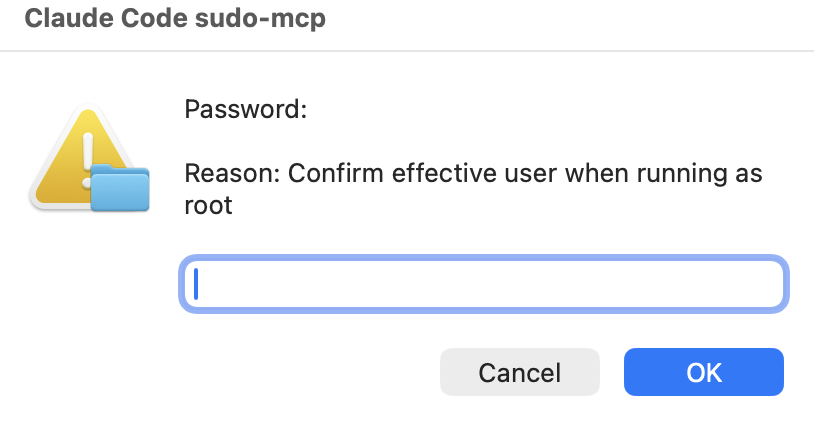

# sudo-mcp

An MCP server that lets a coding agent run `sudo` commands without piping a password through the model.

> Disclaimer: this tool has no command denylist. Whatever command the agent passes, sudo will run it. Add your own guardrails (sudoers `Cmnd_Alias`, wrapper script, sandbox) if you want any.

## The problem

Claude Code's Bash tool redirects stdin to `/dev/null`, so any `sudo` invocation that needs a password fails immediately with `a terminal is required to read the password`. The usual workarounds are bad: `NOPASSWD: ALL` in sudoers gives the agent permanent passive root; running `sudo claude` gives the entire session permanent root; pasting the password into chat exposes it to the model context, the transcript, and any future training set.

## What this does

Without `sudo-mcp`, the agent's `sudo` call dies with `a terminal is required to read the password`.

With `sudo-mcp`, the agent calls `sudo_run(argv, reason)` and a native OS dialog pops up:



You type the password into the dialog. The command runs as root and the agent gets back stdout, stderr, and the exit code. The password never enters the MCP transport, the model context, the conversation transcript, or `~/.bash_history`.

## Install

Requires `sudo`. macOS works out of the box. On Linux you need at least one of `ssh-askpass`, `ksshaskpass`, `zenity`, or `kdialog`.

### Prebuilt binary (recommended)

Grab the archive for your OS/arch from the latest release: https://github.com/0xMH/sudo-mcp/releases/latest

    # macOS arm64 example; substitute the asset for your platform
    curl -L -o sudo-mcp.tar.gz https://github.com/0xMH/sudo-mcp/releases/latest/download/sudo-mcp_v0.1.0_aarch64-apple-darwin.tar.gz
    tar -xzf sudo-mcp.tar.gz
    install -m 0755 sudo-mcp ~/.local/bin/sudo-mcp

Verify the SHA-256 against `checksums.txt` from the same release before running.

### From source

Requires a stable Rust toolchain.

    cargo install --locked --git https://github.com/0xMH/sudo-mcp

The binary lands in Cargo's bin directory, typically `~/.cargo/bin/sudo-mcp`. Make sure that directory is on your `$PATH`, or use the absolute path when registering.

### Just ask Claude to do it

Honestly, the easiest way. Open Claude Code and say something like:

    Install https://github.com/0xMH/sudo-mcp and wire it into my Claude Code config.

It'll read the repo, pull the binaries, register the MCP server, and update your settings. Took me longer to write this paragraph than it takes Claude to do it.

## Wire into Claude Code

Register the server at user scope so it is available in every project:

    claude mcp add sudo-mcp --scope user -- ~/.cargo/bin/sudo-mcp

Verify:

    claude mcp list

You should see `sudo-mcp: ~/.cargo/bin/sudo-mcp - ✓ Connected`.

To make the agent actually prefer `sudo_run` over typing `sudo` into Bash, deny `Bash(sudo *)` in `~/.claude/settings.json`:

```json
{
  "permissions": {
    "deny": ["Bash(sudo *)", "Bash(sudo)"],
    "allow": ["mcp__sudo-mcp__sudo_run"]
  }
}
```

## Tool reference

`sudo_run` takes:

- `argv` (string array, required): command and arguments. Pass as a list, not a shell string. Example: `["apt", "install", "-y", "htop"]`. The server exec's directly with no shell, so injection through arg concatenation is structurally impossible.
- `reason` (string, required): one-line justification rendered in the password dialog so the user sees what they are authorizing before typing the password.
- `timeout_seconds` (int, optional, default 120, max 3600): hard timeout. On macOS/Linux, `sudo-mcp` runs `sudo` in its own process group and kills that group if the timeout expires. It also attempts a non-interactive cached-`sudo` kill for root-owned descendants.
- `cwd` (string, optional): working directory for the command.

Returns a text block with the exit code, stdout, and stderr. Output is truncated at 256 KiB per stream.

## Security properties

- The password is entered into a native OS dialog. The dialog is rendered by the user's window server, not the agent. The agent cannot read it, screenshot it, or replay it.
- The MCP transport carries argv, reason, exit code, stdout, stderr. It never carries credentials.
- `argv` is a list, never a shell string. There is no `bash -c` involved, so no quoting bugs and no injection through reason interpolation.
- Sudo's timestamp cache is left at its system default (typically 5 minutes on macOS). Calls inside that window skip the dialog. Drop `-A` and add `-k` in `src/sudo.rs` if you want a fresh prompt every time.
- The server only exposes one tool. There is no shell access, no arbitrary subprocess execution outside of `sudo`.
- Timeout cleanup is not a sandbox. A command that daemonizes, changes process group/session, or runs under sudoers settings that block the non-interactive cleanup kill may survive the MCP call.

## License

MIT. See LICENSE.
